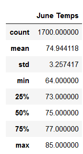
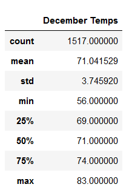

# surfs_up

## Overview of Analysis
The purpose of this analysis is to show the temperature data for the months of June and December in order to determine if the surf and ice cream shop business is sustainable year-round. 

## Results
Based on the analysis, there are some key differences between the weather in June and December. The following are three key differences:
* The average temperature is higher in June
* The minimum temperature is definitely lower in December(56) than in June(64)
* The  max temperature is almost the same for both months (June=85 and Dec= 83)

The following charts show the statistical differences in temperature between June and December.

 

## Summary
The statistical analysis shows the temperature remains steady year-round making it a plus for the shop sustainability. However, there's other data that should be analyzed to assure sustainability. One additional query that could be performed is precipitation. We know temperature is steady throughout the year, but we do not know if precipitation does too. This one is important as it could highly affect the productivity of the shops. Another query is to see what stations are the most popular. This could give us an insight as to what location would be great in accordance with weather pattern. By adding these two queries, the sustainability of the shop could be more guaranteed by more weather parameters and stability.
